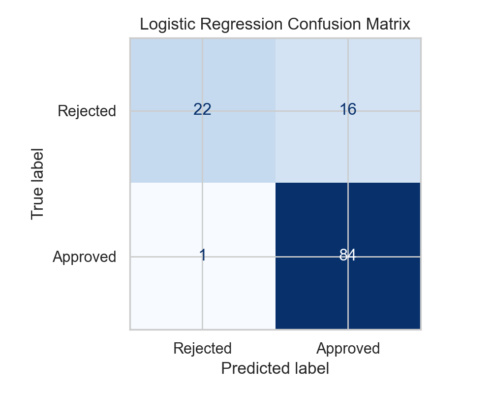

- `C:\Users\Yawo Faustin AZIAKPO\Downloads\LoanDataSet.csv`


```text
 Loan_ID Gender Married Dependents    Education Self_Employed  ApplicantIncome  CoapplicantIncome  LoanAmount  Loan_Amount_Term  Credit_History Property_Area Loan_Status
LP001002   Male      No          0     Graduate            No             5849                0.0         NaN             360.0             1.0         Urban           Y
LP001003   Male     Yes          1     Graduate            No             4583             1508.0       128.0             360.0             1.0         Rural           N
LP001005   Male     Yes          0     Graduate           Yes             3000                0.0        66.0             360.0             1.0         Urban           Y
LP001006   Male     Yes          0 Not Graduate            No             2583             2358.0       120.0             360.0             1.0         Urban           Y
LP001008   Male      No          0     Graduate            No             6000                0.0       141.0             360.0             1.0         Urban           Y
LP001011   Male     Yes          2     Graduate           Yes             5417             4196.0       267.0             360.0             1.0         Urban           Y
LP001013   Male     Yes          0 Not Graduate            No             2333             1516.0        95.0             360.0             1.0         Urban           Y
LP001014   Male     Yes         3+     Graduate            No             3036             2504.0       158.0             360.0             0.0     Semiurban           N
LP001018   Male     Yes          2     Graduate            No             4006             1526.0       168.0             360.0             1.0         Urban           Y
LP001020   Male     Yes          1     Graduate            No            12841            10968.0       349.0             360.0             1.0     Semiurban           N
```

### Missing values before preprocessing

```text
Loan_ID               0
Gender               13
Married               3
Dependents           15
Education             0
Self_Employed        32
ApplicantIncome       0
CoapplicantIncome     0
LoanAmount           22
Loan_Amount_Term     14
Credit_History       50
Property_Area         0
Loan_Status           0
```


- Rows: **614**
- Columns: **13**
- Target classes: **Approved (Y)** and **Rejected (N)**
- Mixed data types: categorical and numeric
- Moderate missingness concentrated in `Credit_History`, `Self_Employed`, `LoanAmount`, `Dependents`, `Loan_Amount_Term`, `Gender`, and `Married`

- Training rows: **491**
- Testing rows: **123**
- Test size: **20%**
- Random state: **42**

Training distribution:

```text
Loan_Status
Approved    337
Rejected    154
```

Testing distribution:

```text
Loan_Status
Approved    85
Rejected    38
```


| Model | Accuracy | Sensitivity | Specificity | ROC AUC |
| --- | --- | --- | --- | --- |
| Logistic Regression | 0.8618 | 0.9882 | 0.5789 | 0.8523 |
| k-Nearest Neighbors | 0.8455 | 0.9765 | 0.5526 | 0.8404 |


| index | Predicted Rejected | Predicted Approved |
| --- | --- | --- |
| Actual Rejected | 22 | 16 |
| Actual Approved | 1 | 84 |



### kNN confusion matrix

| index | Predicted Rejected | Predicted Approved |
| --- | --- | --- |
| Actual Rejected | 21 | 17 |
| Actual Approved | 2 | 83 |


- Logistic regression correct / kNN incorrect: **2**
- Logistic regression incorrect / kNN correct: **0**
- Exact McNemar p-value: **0.5000**

```python
from __future__ import annotations

from pathlib import Path
from textwrap import dedent
from typing import TypeAlias

import matplotlib.pyplot as plt
import numpy as np
import pandas as pd
import seaborn as sns
from scipy.stats import binomtest
from sklearn.compose import ColumnTransformer  
from sklearn.impute import SimpleImputer  
from sklearn.linear_model import LogisticRegression  
from sklearn.metrics import (  
    ConfusionMatrixDisplay,
    accuracy_score,
    confusion_matrix,
    roc_auc_score,
    roc_curve,
)
from sklearn.model_selection import train_test_split  
from sklearn.neighbors import KNeighborsClassifier  
from sklearn.pipeline import Pipeline  
from sklearn.preprocessing import OneHotEncoder, StandardScaler  

REPO_ROOT = Path(__file__).resolve().parents[1]
DEFAULT_DATASET_PATHS = [
    Path.home() / "Downloads" / "LoanDataSet.csv",
    REPO_ROOT / "data" / "LoanDataSet.csv",
]
OUTPUT_DIR = REPO_ROOT / "docs"
PLOTS_DIR = OUTPUT_DIR / "plots"
RANDOM_STATE = 42
TEST_SIZE = 0.20
RocArtifact: TypeAlias = tuple[np.ndarray, np.ndarray, float]
EvaluationArtifacts: TypeAlias = tuple[
    pd.DataFrame,
    dict[str, np.ndarray],
    dict[str, RocArtifact],
    dict[str, np.ndarray],
]


def resolve_dataset_path() -> Path:
    """Use the requested Downloads location first, then a repo-local fallback."""
    for candidate in DEFAULT_DATASET_PATHS:
        if candidate.exists():
            return candidate

    searched = "\n".join(f"- {path}" for path in DEFAULT_DATASET_PATHS)
    raise FileNotFoundError(
        "LoanDataSet.csv was not found. Place it in one of these locations:\n"
        f"{searched}"
    )


def markdown_code_block(text: str) -> str:
    return f"```text\n{text.rstrip()}\n```"


def float_fmt(value: float) -> str:
    return f"{value:.4f}"


def dataframe_to_markdown_table(dataframe: pd.DataFrame, include_index: bool = False) -> str:
    frame = dataframe.copy()
    if include_index:
        frame = frame.reset_index()

    headers = [str(column) for column in frame.columns]
    rows = [[str(value) for value in row] for row in frame.to_numpy().tolist()]
    divider = ["---"] * len(headers)
    table_lines = [
        "| " + " | ".join(headers) + " |",
        "| " + " | ".join(divider) + " |",
    ]
    table_lines.extend("| " + " | ".join(row) + " |" for row in rows)
    return "\n".join(table_lines)


def left_trim_eight_spaces(text: str) -> str:
    return "\n".join(
        line[8:] if line.startswith("        ") else line for line in text.splitlines()
    )


def build_preprocessor(features: pd.DataFrame) -> ColumnTransformer:
    numeric_features = features.select_dtypes(include="number").columns.tolist()
    categorical_features = [
        column for column in features.columns if column not in numeric_features
    ]

    numeric_pipeline = Pipeline(
        steps=[
            ("imputer", SimpleImputer(strategy="median")),
            ("scaler", StandardScaler()),
        ]
    )
    categorical_pipeline = Pipeline(
        steps=[
            ("imputer", SimpleImputer(strategy="most_frequent")),
            ("encoder", OneHotEncoder(handle_unknown="ignore")),
        ]
    )

    return ColumnTransformer(
        transformers=[
            ("numeric", numeric_pipeline, numeric_features),
            ("categorical", categorical_pipeline, categorical_features),
        ]
    )


def specificity_from_confusion_matrix(matrix: np.ndarray) -> float:
    tn, fp, _, _ = matrix.ravel()
    return tn / (tn + fp)


def sensitivity_from_confusion_matrix(matrix: np.ndarray) -> float:
    _, _, fn, tp = matrix.ravel()
    return tp / (tp + fn)


def plot_class_distribution(dataframe: pd.DataFrame, output_path: Path) -> None:
    sns.set_theme(style="whitegrid")
    plt.figure(figsize=(7, 4))
    order = ["Y", "N"]
    ax = sns.countplot(
        data=dataframe,
        x="Loan_Status",
        hue="Loan_Status",
        order=order,
        palette="deep",
        legend=False,
    )
    ax.set_title("Loan status distribution")
    ax.set_xlabel("Loan status")
    ax.set_ylabel("Count")
    for patch in ax.patches:
        ax.annotate(
            f"{int(patch.get_height())}",
            (patch.get_x() + patch.get_width() / 2, patch.get_height()),
            ha="center",
            va="bottom",
        )
    plt.tight_layout()
    plt.savefig(output_path, dpi=200)
    plt.close()


def plot_missing_values(dataframe: pd.DataFrame, output_path: Path) -> None:
    missing = dataframe.isna().sum().sort_values(ascending=False)
    missing = missing[missing > 0]
    plt.figure(figsize=(9, 4))
    ax = sns.barplot(
        x=missing.index,
        y=missing.values,
        hue=missing.index,
        palette="magma",
        legend=False,
    )
    ax.set_title("Missing values before preprocessing")
    ax.set_xlabel("Feature")
    ax.set_ylabel("Missing values")
    ax.tick_params(axis="x", rotation=45)
    plt.tight_layout()
    plt.savefig(output_path, dpi=200)
    plt.close()


def plot_confusion_matrix(
    matrix: np.ndarray, title: str, output_path: Path, labels: list[str]
) -> None:
    fig, ax = plt.subplots(figsize=(5, 4))
    disp = ConfusionMatrixDisplay(confusion_matrix=matrix, display_labels=labels)
    disp.plot(ax=ax, cmap="Blues", colorbar=False)
    ax.set_title(title)
    plt.tight_layout()
    plt.savefig(output_path, dpi=200)
    plt.close(fig)


def plot_roc_curves(
    roc_artifacts: dict[str, tuple[np.ndarray, np.ndarray, float]], output_path: Path
) -> None:
    plt.figure(figsize=(7, 5))
    for name, (false_positive_rate, true_positive_rate, auc_score) in roc_artifacts.items():
        plt.plot(
            false_positive_rate,
            true_positive_rate,
            linewidth=2,
            label=f"{name} (AUC = {auc_score:.3f})",
        )
    plt.plot([0, 1], [0, 1], linestyle="--", color="gray", label="Random guess")
    plt.xlabel("False Positive Rate")
    plt.ylabel("True Positive Rate")
    plt.title("ROC curve comparison")
    plt.legend(loc="lower right")
    plt.tight_layout()
    plt.savefig(output_path, dpi=200)
    plt.close()


def evaluate_models(
    features_train: pd.DataFrame,
    features_test: pd.DataFrame,
    target_train: pd.Series,
    target_test: pd.Series,
    preprocessor: ColumnTransformer,
) -> EvaluationArtifacts:
    model_candidates = {
        "Logistic Regression": LogisticRegression(
            max_iter=2000,
            random_state=RANDOM_STATE,
        ),
        "k-Nearest Neighbors": KNeighborsClassifier(n_neighbors=7),
    }

    metrics_rows: list[dict[str, float | str]] = []
    confusion_matrices: dict[str, np.ndarray] = {}
    roc_artifacts: dict[str, RocArtifact] = {}
    predictions: dict[str, np.ndarray] = {}

    for model_name, estimator in model_candidates.items():
        model = Pipeline(
            steps=[
                ("preprocessor", preprocessor),
                ("classifier", estimator),
            ]
        )
        model.fit(features_train, target_train)

        predicted_labels = model.predict(features_test)
        predicted_probabilities = model.predict_proba(features_test)[:, 1]
        matrix = confusion_matrix(target_test, predicted_labels, labels=[0, 1])
        auc_score = roc_auc_score(target_test, predicted_probabilities)
        false_positive_rate, true_positive_rate, _ = roc_curve(
            target_test, predicted_probabilities
        )

        confusion_matrices[model_name] = matrix
        roc_artifacts[model_name] = (
            false_positive_rate,
            true_positive_rate,
            auc_score,
        )
        predictions[model_name] = predicted_labels
        metrics_rows.append(
            {
                "Model": model_name,
                "Accuracy": accuracy_score(target_test, predicted_labels),
                "Sensitivity": sensitivity_from_confusion_matrix(matrix),
                "Specificity": specificity_from_confusion_matrix(matrix),
                "ROC AUC": auc_score,
            }
        )

    metrics_frame = pd.DataFrame(metrics_rows).sort_values(
        by=["Accuracy", "ROC AUC"], ascending=False
    )
    return metrics_frame, confusion_matrices, roc_artifacts, predictions


def run_mcnemar_test(
    actual_values: pd.Series,
    first_predictions: np.ndarray,
    second_predictions: np.ndarray,
) -> tuple[int, int, float]:
    first_correct = first_predictions == actual_values.to_numpy()
    second_correct = second_predictions == actual_values.to_numpy()

    first_right_second_wrong = int(np.sum(first_correct & ~second_correct))
    first_wrong_second_right = int(np.sum(~first_correct & second_correct))

    if first_right_second_wrong + first_wrong_second_right == 0:
        return first_right_second_wrong, first_wrong_second_right, 1.0

    p_value = binomtest(
        min(first_right_second_wrong, first_wrong_second_right),
        n=first_right_second_wrong + first_wrong_second_right,
        p=0.5,
        alternative="two-sided",
    ).pvalue
    return first_right_second_wrong, first_wrong_second_right, p_value


def write_report(
    dataset_path: Path,
    dataframe: pd.DataFrame,
    features_train: pd.DataFrame,
    features_test: pd.DataFrame,
    target_train: pd.Series,
    target_test: pd.Series,
    metrics_frame: pd.DataFrame,
    confusion_matrices: dict[str, np.ndarray],
    first_better: int,
    second_better: int,
    mcnemar_p_value: float,
) -> None:
    metrics_table = metrics_frame.copy()
    for column in ["Accuracy", "Sensitivity", "Specificity", "ROC AUC"]:
        metrics_table[column] = metrics_table[column].map(float_fmt)

    source_code = Path(__file__).read_text()
    head_preview = dataframe.head(10).to_string(index=False)
    missing_values = dataframe.isna().sum().to_string()
    training_distribution = target_train.map({1: "Approved", 0: "Rejected"}).value_counts()
    testing_distribution = target_test.map({1: "Approved", 0: "Rejected"}).value_counts()

    logistic_matrix = pd.DataFrame(
        confusion_matrices["Logistic Regression"],
        index=["Actual Rejected", "Actual Approved"],
        columns=["Predicted Rejected", "Predicted Approved"],
    )
    knn_matrix = pd.DataFrame(
        confusion_matrices["k-Nearest Neighbors"],
        index=["Actual Rejected", "Actual Approved"],
        columns=["Predicted Rejected", "Predicted Approved"],
    )

    report_prefix = left_trim_eight_spaces(
        dedent(
        f"""

        - `{dataset_path}`


        {markdown_code_block(head_preview)}

        ### Missing values before preprocessing

        {markdown_code_block(missing_values)}


        - Rows: **{len(dataframe)}**
        - Columns: **{len(dataframe.columns)}**
        - Target classes: **Approved (Y)** and **Rejected (N)**
        - Mixed data types: categorical and numeric
        - Moderate missingness concentrated in `Credit_History`, `Self_Employed`, `LoanAmount`, `Dependents`, `Loan_Amount_Term`, `Gender`, and `Married`

        - Training rows: **{len(features_train)}**
        - Testing rows: **{len(features_test)}**
        - Test size: **{int(TEST_SIZE * 100)}%**
        - Random state: **{RANDOM_STATE}**

        Training distribution:

        {markdown_code_block(training_distribution.to_string())}

        Testing distribution:

        {markdown_code_block(testing_distribution.to_string())}


        {dataframe_to_markdown_table(metrics_table, include_index=False)}

       

        {dataframe_to_markdown_table(logistic_matrix, include_index=True)}

        

        ### kNN confusion matrix

        {dataframe_to_markdown_table(knn_matrix, include_index=True)}

        
        - Logistic regression correct / kNN incorrect: **{first_better}**
        - Logistic regression incorrect / kNN correct: **{second_better}**
        - Exact McNemar p-value: **{float_fmt(mcnemar_p_value)}**

        """
        ).strip()
    )

    report_code_section = f"```python\n{source_code.rstrip()}\n```"
    report_suffix = left_trim_eight_spaces(
        dedent("").strip()
    )

    report = "\n\n".join([report_prefix, report_code_section, report_suffix])
    (OUTPUT_DIR / "technical_report.md").write_text(report + "\n")


def main() -> None:
    dataset_path = resolve_dataset_path()
    OUTPUT_DIR.mkdir(parents=True, exist_ok=True)
    PLOTS_DIR.mkdir(parents=True, exist_ok=True)

    dataframe = pd.read_csv(dataset_path)
    features = dataframe.drop(columns=["Loan_Status", "Loan_ID"])
    target = dataframe["Loan_Status"].map({"Y": 1, "N": 0})

    features_train, features_test, target_train, target_test = train_test_split(
        features,
        target,
        test_size=TEST_SIZE,
        random_state=RANDOM_STATE,
        stratify=target,
    )

    preprocessor = build_preprocessor(features)
    metrics_frame, confusion_matrices, roc_artifacts, predictions = evaluate_models(
        features_train=features_train,
        features_test=features_test,
        target_train=target_train,
        target_test=target_test,
        preprocessor=preprocessor,
    )

    plot_class_distribution(dataframe, PLOTS_DIR / "class_distribution.png")
    plot_missing_values(dataframe, PLOTS_DIR / "missing_values.png")
    plot_confusion_matrix(
        confusion_matrices["Logistic Regression"],
        "Logistic Regression Confusion Matrix",
        PLOTS_DIR / "logistic_regression_confusion_matrix.png",
        labels=["Rejected", "Approved"],
    )
    plot_confusion_matrix(
        confusion_matrices["k-Nearest Neighbors"],
        "k-Nearest Neighbors Confusion Matrix",
        PLOTS_DIR / "k_nearest_neighbors_confusion_matrix.png",
        labels=["Rejected", "Approved"],
    )
    plot_roc_curves(roc_artifacts, PLOTS_DIR / "roc_curves.png")

    first_better, second_better, mcnemar_p_value = run_mcnemar_test(
        actual_values=target_test,
        first_predictions=predictions["Logistic Regression"],
        second_predictions=predictions["k-Nearest Neighbors"],
    )

    write_report(
        dataset_path=dataset_path,
        dataframe=dataframe,
        features_train=features_train,
        features_test=features_test,
        target_train=target_train,
        target_test=target_test,
        metrics_frame=metrics_frame,
        confusion_matrices=confusion_matrices,
        first_better=first_better,
        second_better=second_better,
        mcnemar_p_value=mcnemar_p_value,
    )

    print(f"Dataset used: {dataset_path}")
    print(f"Report written to: {OUTPUT_DIR / 'technical_report.md'}")
    print("Metrics summary:")
    print(metrics_frame.to_string(index=False))


if __name__ == "__main__":
    main()
```


